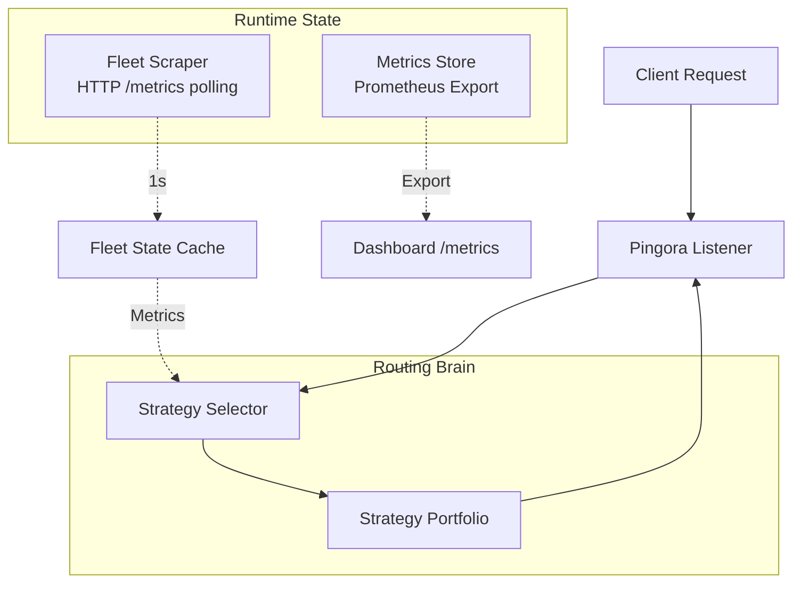
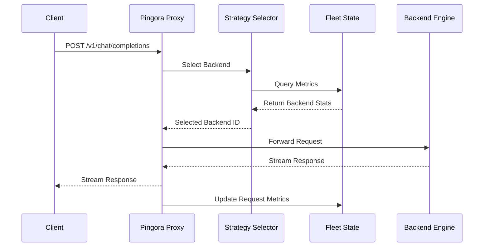
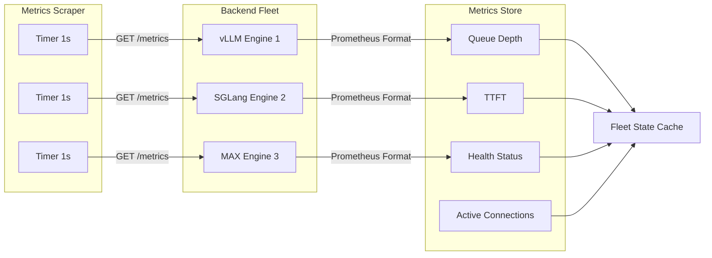
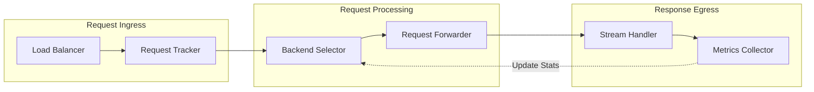

# Kairos
**High-Performance Load Balancer & Proxy for LLM Inference**

> **Project Goal:** A deliberate practice project for mastering production Rust, async concurrency, and distributed networking. Built to develop hands-on muscle memory with high-performance proxies, metrics collection, and intelligent load balancing algorithms.

## Overview
Kairos is a load balancer and reverse proxy that sits in front of a fleet of LLM inference engines (vLLM, SGLang, MAX). It provides intelligent request routing based on real-time metrics scraped from backend inference engines, with multiple selection algorithms and a dashboard for visibility into fleet health and performance.

### Core Design
- **Pingora Native:** Uses Cloudflare Pingora for zero-copy proxying and connection management.
- **Metrics Scraping:** Continuously polls each engine's `/metrics` endpoint (Prometheus format) to track queue depth, health status, TTFT (Time to First Token), and throughput.
- **Multiple Selection Algorithms:** Supports various load balancing strategies including Round Robin, Least Load, Lowest Latency, and Prefix Locality routing.
- **Real-Time Visibility:** Provides a dashboard and metrics endpoint for users to monitor fleet state, backend health, and routing decisions.

## Routing Strategies

| Strategy | Logic | Use Case |
|----------|-------|----------|
| RoundRobin | Cyclic distribution across healthy backends | Baseline fallback, even distribution |
| LeastLoad | Routes to backend with lowest active queue depth | Traffic spikes, batch-heavy workloads |
| LowestLatency | Routes to backend with best recent TTFT | Latency-sensitive inference |
| PrefixLocality | Routes based on cached prompt prefix match | KV cache reuse, multi-turn chats |
| Weighted | Distribution based on configured weights | Heterogeneous backend capacity |
| LeastConnections | Routes to backend with fewest active connections | Long-running streaming requests |

The strategy selector evaluates backend metrics and applies the configured algorithm to determine optimal routing for each request. Strategies can be configured globally or per-endpoint.

## Architecture

### System Overview



### Request Flow



### Metrics Scraping Flow



### Data Flow



## Components

### Core Components

| Component | Responsibility | Implementation |
|-----------|----------------|----------------|
| Listener | Ingress proxy, OpenAI-compatible /v1/chat/completions routing | Pingora ProxyHttp trait |
| Routing Brain | Strategy evaluation and backend selection | Trait-based strategy implementations |
| Strategy Selector | Algorithm-based backend weighting | Configurable selection algorithms |
| Fleet Scraper | Metric aggregation from backend engines | Async HTTP client (reqwest) + prometheus-parse |
| Metrics Export | Prometheus-compatible metrics endpoint | prometheus crate |
| Health Checker | Backend health monitoring and circuit breaking | Periodic health checks with failure thresholds |
| Connection Pool | Upstream connection management | HTTP/2 connection pooling with keepalive |

### Metrics Collected

| Metric | Source | Description |
|--------|--------|-------------|
| `kairos_backend_queue_depth` | Backend /metrics | Current pending request count |
| `kairos_backend_ttft_seconds` | Backend /metrics | Time to first token (rolling average) |
| `kairos_backend_health_status` | Health checker | Backend health (1=healthy, 0=unhealthy) |
| `kairos_backend_active_connections` | Proxy | Current active connections to backend |
| `kairos_requests_total` | Proxy | Total requests routed (by backend, status) |
| `kairos_request_duration_seconds` | Proxy | Request latency histogram |
| `kairos_strategy_selections_total` | Selector | Strategy usage count (by strategy name) |

## Configuration

### Example Configuration

```yaml
# kairos.yaml
listener:
  host: 0.0.0.0
  port: 8080

backends:
  - id: vllm-1
    url: http://localhost:8000
    weight: 1
  - id: vllm-2
    url: http://localhost:8001
    weight: 1
  - id: sglang-1
    url: http://localhost:8002
    weight: 1

routing:
  strategy: LeastLoad
  fallback: RoundRobin
  health_check_interval_ms: 5000

scraping:
  interval_ms: 1000
  timeout_ms: 500
  metrics_path: /metrics

metrics:
  enabled: true
  path: /metrics
  port: 9090
```

## Tech Stack

| Layer | Technology |
|-------|------------|
| Language | Rust (Stable) |
| Async Runtime | Tokio |
| Proxy Engine | Cloudflare Pingora |
| HTTP Client | reqwest |
| Metrics | prometheus crate |
| Metrics Parsing | prometheus-parse + regex |
| Serialization | serde, serde_json |
| Logging | tracing, tracing-subscriber |
| Protocol | HTTP/1.1 for scraping, HTTP/2 for upstream inference |

## API Endpoints

### Proxy Endpoints

| Endpoint | Method | Description |
|----------|--------|-------------|
| `/v1/chat/completions` | POST | OpenAI-compatible chat completions |
| `/v1/completions` | POST | OpenAI-compatible completions |
| `/health` | GET | Proxy health check |

### Admin Endpoints

| Endpoint | Method | Description |
|----------|--------|-------------|
| `/metrics` | GET | Prometheus-compatible metrics |
| `/admin/backends` | GET | List all configured backends with status |
| `/admin/backends/:id` | GET | Get specific backend details |
| `/admin/backends/:id/health` | POST | Manually trigger health check for backend |
| `/admin/strategy` | GET | Get current routing strategy |
| `/admin/strategy` | PUT | Update routing strategy |

## Build Phases

| Phase | Status | Deliverable |
|-------|--------|-------------|
| 1. Working Proxy | In Progress | Pingora listener, round-robin routing, local admin/metrics, request forwarding |
| 2. Fleet Visibility | Todo | Background /metrics scraper, LeastLoad + LowestLatency strategies, Prometheus metrics export |
| 3. Prefix Awareness | Todo | Prefix metadata store, PrefixLocality strategy |
| 4. Dashboard & Observability | Todo | Web dashboard for fleet state, health visualization, routing analytics |
| 5. Hardening | Todo | Circuit breakers, retry logic, graceful shutdown, config validation |

## Design Principles

- **Pingora Core:** Proxy and routing logic built entirely on Pingora.
- **Metrics-Driven:** All routing decisions based on scraped metrics from backend inference engines.
- **Learning Focus:** Explicitly scoped for Rust systems mastery: async patterns, zero-copy routing, concurrent state management, and observability.
- **Observability First:** Comprehensive metrics, tracing, and logging at every layer.
- **Graceful Degradation:** Circuit breakers and fallbacks ensure partial failures don't cascade.

---

Built by Ammar for deliberate practice in production Rust and distributed systems engineering.
