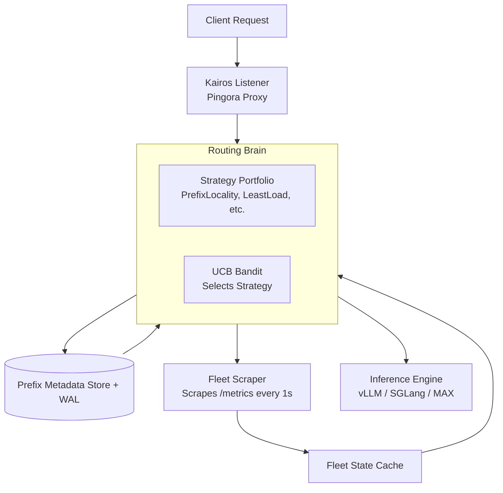

# Kairos
**Adaptive Inference Router with a Learning Routing Plane**

> **Note:** This is a hands-on mastery project focused on building production-grade Rust systems, deepening knowledge of distributed networking, and implementing complex routing algorithms. It serves as a practical vehicle for mastering Rust, Pingora, and high-performance distributed systems design.

## Overview
Kairos sits in front of a fleet of LLM inference engines (vLLM, SGLang, MAX). Unlike dumb routers (round-robin, least-connections), Kairos adapts to traffic patterns in real-time. It combines **prefix-aware caching**, **dynamic metric scraping**, and **online learning** (Multi-Armed Bandits) to route requests to the optimal engine.

### Why Kairos?
- **Performance:** Built on **Cloudflare Pingora** for superior proxying and concurrency compared to standard Axum.
- **Intelligence:** Learns which routing strategy works best for current conditions using UCB bandits.
- **Visibility:** Scrapes `/metrics` from all engines for real-time fleet state (queue depth, latency, health) without intrusive active polling.
- **Learning Focus:** Designed to build "muscle memory" in Rust, async Tokio patterns, and distributed system hardening.

---

##  Core Features

### 1. Prefix-Aware Routing
Maintains an in-memory metadata store (with WAL persistence) to track KV cache locations.
- **Strategy:** `PrefixLocality` routes requests to the engine holding the longest matching prompt prefix cache, minimizing re-computation.

### 2. Dynamic Strategy Portfolio
Supports multiple routing strategies that can be swapped dynamically:
- `PrefixLocality`: Longest cached prefix match.
- `LeastLoad`: Routes to the engine with the lowest queue depth.
- `LowestLatency`: Routes based on recent Time-To-First-Token (TTFT).
- `RoundRobin`: Baseline fallback.

### 3. The Learning Routing Plane
Treats strategy selection as a **Multi-Armed Bandit (UCB)** problem.
- Observes outcomes (inverse TTFT).
- Shifts weights toward the best-performing strategy for the current traffic pattern.
- Continuously learns and adapts without human intervention.

### 4. Fleet Scraper & Observability
A background task scrapes each engine's `/metrics` endpoint every second.
- **Data Collected:** Queue depth, health status, latency metrics.
- **Benefit:** Replaces expensive active probing with lightweight metric scraping for accurate fleet state.

---

##  Architecture



### Key Components
| Component | Description | Tech |
| :--- | :--- | :--- |
| **Listener** | High-performance ingress proxy handling OpenAI-compatible requests. | Pingora |
| **Routing Brain** | Orchestrates strategy selection and engine picking. | Rust / Tokio |
| **Bandit** | Implements Upper Confidence Bound (UCB) algorithm for strategy optimization. | Rust |
| **Prefix Store** | In-memory hash map with Write-Ahead Log (WAL) for crash recovery. | Custom Rust |
| **Fleet Scraper** | Background worker aggregating metrics from all backend engines. | rust-prometheus |

---

##  Tech Stack
- **Language:** Rust (Stable)
- **Async Runtime:** Tokio
- **Proxy Layer:** Cloudflare Pingora (Custom HTTP/2 proxy)
- **Metrics:** `rust-prometheus`
- **Persistence:** Custom Append-Only WAL with CRC checks
- **Networking:** gRPC/HTTP2 for internal scraping

---

##  Development Phases

| Phase | Status | Focus |
| :--- | :--- | :--- |
| **Phase 1** | 🟡 In Progress | Pingora listener, basic round-robin, Axum admin/metrics, forwarding logic. |
| **Phase 2** | ⬜ Todo | Background scraper for `/metrics`. Implement `LeastLoad` & `LowestLatency`. |
| **Phase 3** | ⬜ Todo | Prefix metadata store + WAL. Implement `PrefixLocality` strategy. |
| **Phase 4** | ⬜ Todo | Integrate UCB Bandit to select strategies dynamically based on rewards. |
| **Phase 5** | ⬜ Todo | Hardening: Circuit breakers, retries, graceful shutdown, configuration management. |

---

##  What This Demonstrates
This project is a rigorous exercise in:
1.  **Production Rust:** Writing zero-copy, high-concurrency code with Pingora.
2.  **Distributed Systems:** Handling eventual consistency, state synchronization, and fault tolerance.
3.  **Algorithms:** Implementing online learning (Bandits) and caching strategies in a low-latency environment.
4.  **Systems Design:** Moving beyond theory to implement a full-stack router with observability.

## 🚦 Getting Started
*Clone the repo and build:*
```bash
git clone https://github.com/Ammar-Alnagar/Kairos
cd kairos
cargo build --release
```
*Run with default config:*
```bash
./target/release/kairos --config config.yaml
```

---
*Built by Ammar for mastering Rust and Distributed Systems.*
