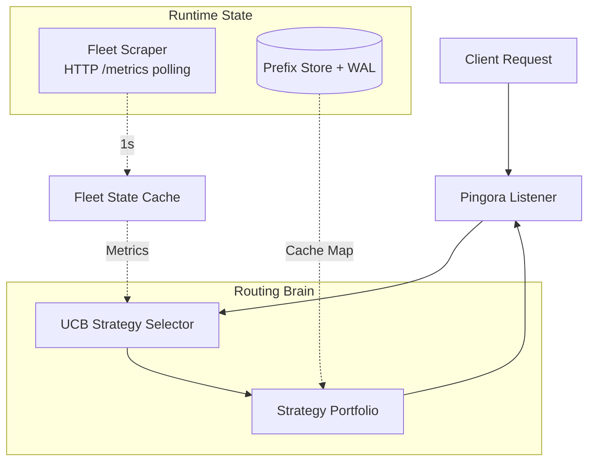

```markdown
# Kairos
**Adaptive Inference Router with a Learning Routing Plane**

> **Project Goal:** A deliberate practice project for mastering production Rust, async concurrency, and distributed networking. Built to develop hands-on muscle memory with high-performance proxies, state management, and low-latency routing algorithms.

## Overview
Kairos sits in front of a fleet of LLM inference engines (vLLM, SGLang, MAX). It replaces static load balancers with a metric-driven router that evaluates fleet state, tracks KV cache locality, and selects the optimal routing strategy using statistical bandits.

### Core Design
- **Pingora Native:** Uses Cloudflare Pingora for zero-copy proxying and connection management.
- **Metric-Driven Scraping:** Polls each engine /metrics endpoint (Prometheus format) every 1s to track queue depth, health, and TTFT. Replaces active probing or heartbeat pings.
- **Statistical Strategy Selection:** Uses Upper Confidence Bound (UCB) to balance exploration and exploitation across routing strategies. Pure arithmetic. No tokenizers, no RL, no policy networks.
- **Prefix-Aware Routing:** Maintains an in-memory metadata store (backed by a custom WAL) to track which engine holds cached KV prefixes for given prompts.

## Routing Strategies
| Strategy | Logic | Use Case |
|----------|-------|----------|
| RoundRobin | Cyclic distribution | Baseline fallback |
| LeastLoad | Lowest active queue depth | Traffic spikes, batch-heavy workloads |
| LowestLatency | Best recent TTFT | Latency-sensitive inference |
| PrefixLocality | Longest cached prompt prefix match | KV cache reuse, multi-turn chats |

The UCB selector assigns a score to each strategy based on observed inverse-TTFT rewards and exploration bonuses, dynamically weighting selection toward the best performer for current traffic conditions.

## Architecture


### Components
| Component | Responsibility | Implementation |
|-----------|----------------|----------------|
| Listener | Ingress proxy, OpenAI-compatible /v1/chat/completions routing | Pingora ProxyHttp trait |
| Routing Brain | Strategy evaluation and engine selection | Stateless trait implementations |
| UCB Selector | Statistical strategy weighting | Running averages plus exploration bonus |
| Prefix Store | prompt_hash to engine_id mapping plus crash recovery | In-memory HashMap plus custom append-only WAL |
| Fleet Scraper | Metric aggregation from backend engines | Async HTTP client plus prometheus-parse |

## Tech Stack
| Layer | Technology |
|-------|------------|
| Language | Rust (Stable) |
| Async Runtime | Tokio |
| Proxy Engine | Cloudflare Pingora |
| Metrics Parsing | prometheus-parse + regex |
| Persistence | Custom append-only WAL with CRC32 validation |
| Protocol | HTTP/1.1 for scraping, HTTP/2 for upstream inference |

## Build Phases
| Phase | Status | Deliverable |
|-------|--------|-------------|
| 1. Working Proxy | In Progress | Pingora listener, round-robin routing, local admin/metrics, request forwarding |
| 2. Fleet Visibility | Todo | Background /metrics scraper, LeastLoad plus LowestLatency strategies |
| 3. Prefix Awareness | Todo | Prefix metadata store, WAL persistence, PrefixLocality strategy |
| 4. Strategy Learning | Todo | UCB bandit integration, reward observation (1/TTFT), dynamic weighting |
| 5. Hardening | Todo | Circuit breakers, retry logic, graceful shutdown, config validation |

## Constraint Compliance
- No Tokenizers: Prefix matching uses byte-level hashing. Zero NLP/tokenization overhead.
- No RL: UCB is a deterministic statistical selector. No gradients, no policy updates, no stateful learning loops.
- Pingora Core: Proxy and routing logic built entirely on Pingora.
- Learning Focus: Explicitly scoped for Rust systems mastery: async patterns, zero-copy routing, concurrent state, WAL design, and observability.

Built by Ammar for deliberate practice in production Rust and distributed systems engineering.
```
